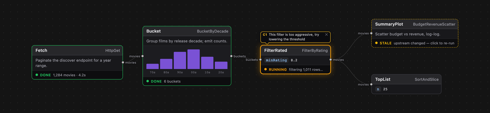
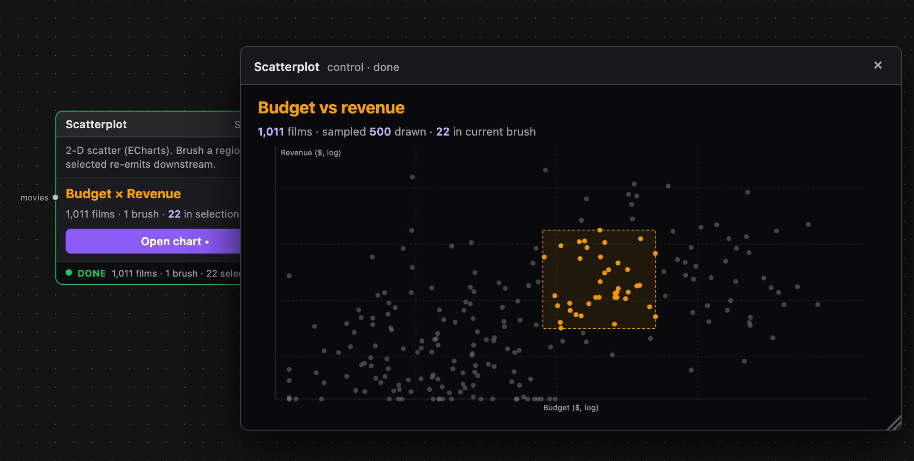

# Cocoon

**Agent-first, flow-based data processing.** A collaborative data-mining environment where the agent builds the graph and you steer and monitor — and the same flow carries you from raw data to interactive exploration to running automation, in one tool.


## What you see

The editor is a read-only canvas of your flow, coloured by status. The flow itself lives in `cocoon.yml` next to your code — both you and the agent edit that file directly, in your own text editor. The canvas re-renders as the file changes.



Each node carries a **process** (its Node.js work) and optionally a **control** — a code-declared affordance that renders on the node itself, or in a detached window. A control might be a steering knob, a chart, a form, or a custom annotation UI. Controls are Cocoon's view layer; there is no separate visualisation subsystem.



## The mental model in two minutes

A **flow** is a graph of **nodes** persisted as a single `cocoon.yml`. Each node has typed **ports** for its inputs and outputs. An `in:` value that's a `cocoon://` URI is an **edge** (wires one port to another); a plain literal value is just config (no handle, shown as a title slice on the node).

```yaml
nodes:
  fetch:
    type: HttpGet
    in:
      url: https://api.example.com/movies     # config (literal)

  filter:
    type: FilterByRating
    in:
      data: cocoon://fetch/out/data           # edge
      minRating: 7.5                          # config
```

A node's `type:` resolves by convention to a file: `FilterByRating` → `nodes/FilterByRating.ts` next to the flow. No registry, no central vocabulary. Cocoon itself ships zero nodes — every node a flow uses lives next to it (or in a project-shared `nodes/` dir you declare). The platform is the runtime; the vocabulary is yours.

## A node is one file

```ts
// nodes/FilterByRating.ts

export const process = async ({ data, minRating }) => ({
  data: data.filter(m => m.rating >= minRating),
});

export const control = {
  data: async (ctx) => ({
    kept: ctx.ports.out.data?.length ?? 0,
    total: ctx.ports.in.data?.length ?? 0,
  }),
  render: ({ kept, total }) =>
    `<div>${kept} of ${total} movies pass the filter</div>`,
};
```

That's the whole contract. `process` runs on the Node.js core; `control` is the LiveView-style action tier (server-built HTML, optionally with a browser-side `hook` for free-form interactivity). No build step, no scaffolding — edit the file, save, the next pull picks up the change. The core esbuild-bundles the optional `hook` export on demand and serves it to the browser, keyed by file mtime.

## Pull, not push

Nothing recomputes behind your back. You **run to** a node and the core processes it plus its transitive upstream in topological order, memoising completed work. Six streamed statuses — `idle · queued · running · done · stale · error` — are the only thing the canvas colours by.

When a node's inputs change, the **result is kept** and the node is just marked stale ("click to re-run"). Everything reachable downstream ages with it. You decide when to re-pull. Errors block downstream nodes only along the failing branch — independent branches keep running.

## Collaboration is the substrate

This is the part the screenshots can't sell. The agent is **a peer client** alongside your editor, not just a chat sidebar. It reads graph state and inspects node data through the same surface the CLI exposes, and it edits `cocoon.yml` and node files the same way you do. But it can also collaborate through an orthogonal **presence channel** that the processing engine never reads:

- **Callouts** — chat-friendly speech bubbles the agent drops on a node ("← I think this filter is too tight"). They survive the agent disconnecting because the editor snapshots them locally.
- **Suggestions** — change-sets the agent announces; you Apply or Discard with one click. The agent can also read your *unsaved* control text via presence, so it can suggest into work-in-progress.
- **Selections** for brushing & linking — taken on top of the same channel, since a selection is just one more field a client announces.

## Quick start

```sh
git clone https://github.com/aengl/cocoon
cd cocoon
pnpm install
node core/cli.ts install-cli      # symlinks `cocoon` into ~/.local/bin
cocoon install-skill              # registers the Cocoon skill with Claude Code
```

The first step puts a `cocoon` command on your PATH (a symlink back into this checkout — `git pull` updates it for free). The second is the important one — it makes the agent fluent in Cocoon. From any directory, you can now ask Claude:

> *"Use the Cocoon skill to scaffold a new flow in `~/films` that pulls the top 100 sci-fi movies of the last decade from TMDB and plots budget vs revenue. Walk me through it as you build."*

Claude will create the directory, write `cocoon.yml` + the necessary node files, start the core and the editor, and drop callouts on the canvas as it goes. The whole onboarding is one prompt.

If you'd rather drive it by hand, run a flow directly:

```sh
cocoon serve examples/tmdb
```

Open <http://localhost:22242>. One process serves both the editor and the core; statuses stream live over a WebSocket on the same origin.

## Where Cocoon sits

There are plenty of "build your pipeline with AI" tools now — Cocoon is opinionated about a different point in the space.

- **vs Langflow / Flowise / n8n** — those are no-code DAG builders with marketplaces of pre-built nodes. Cocoon is code-first: every node is a JS/TS file you (or the agent) write. There is no node library, no marketplace, no point-and-click graph editing. The agent does the wiring.
- **vs KNIME** — a beloved ancestor and the project's original inspiration. KNIME's strength is its huge node library; Cocoon's bet is that AI makes bespoke nodes cheap enough that a library is the wrong abstraction.
- **vs Jupyter notebooks** — notebooks are linear and hidden-state-heavy. Cocoon is a typed DAG with explicit ports and deterministic recomputation. Same exploration affordance, structurally honest.

If you want a no-code GUI, Langflow or n8n will serve you better. If you want a typed dataflow you can hand to an agent today and ship to production tomorrow, that's Cocoon.

## Examples

Reference flows under [`examples/`](examples) — meant to be run, read, and forked.

- **[tmdb](examples/tmdb)** — discovery + curation over The Movie Database. Ingests + enriches a year-range of releases (with a persisted cache), runs k-means clustering and a brushable parallel-coordinates view for exploration, surfaces non-obvious candidate groups (density spikes in genre × year slices), then turns human-judged selections into curated top-N lists. Showcases the full "mining → judgement → curation" loop, the persist cache, brushable controls, and most of the steering/free-form control idioms in one place.
- **[bgg](examples/bgg)** *(coming soon)* — a BoardGameGeek collection-analysis flow exploring the same patterns over a smaller, more personal dataset.

## Status

Cocoon is a clean Svelte rebuild, feature-complete for daily use but pre-1.0 — APIs may shift before we cut a stable release.

## Contact

Open an issue, or write directly to [aengl](https://github.com/aengl).
